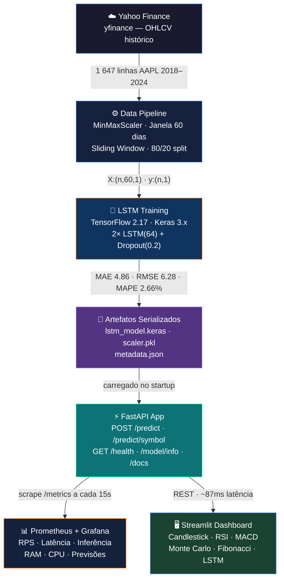
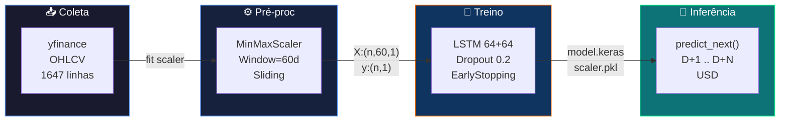
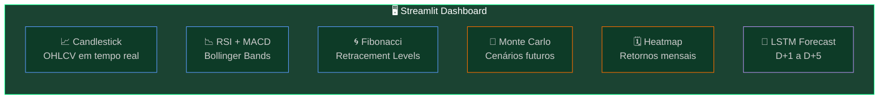
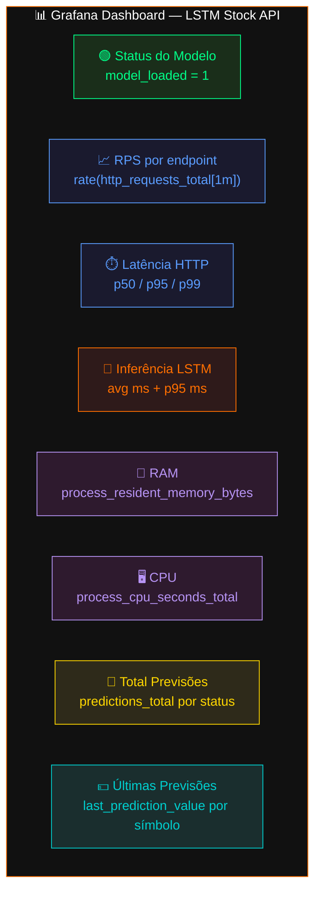

<div align="center">

# 📈 LSTM Stock Prediction API

### Previsão de Preços de Ações com Deep Learning

*PosTech · Machine Learning Engineering · FIAP · Tech Challenge Fase 4*

<br/>

[](https://pos-tech-mlet-fase-4.onrender.com/health)
[](https://lstm-stock-dashboard.onrender.com)
[](https://pos-tech-mlet-fase-4.onrender.com/docs)
[](https://python.org)
[](https://tensorflow.org)
[](https://docker.com)
[](LICENSE)

<br/>

**[🖥️ Dashboard ao Vivo](https://lstm-stock-dashboard.onrender.com)** &nbsp;·&nbsp;
**[⚡ API REST](https://pos-tech-mlet-fase-4.onrender.com)** &nbsp;·&nbsp;
**[📖 Swagger UI](https://pos-tech-mlet-fase-4.onrender.com/docs)** &nbsp;·&nbsp;
**[🔍 Health Check](https://pos-tech-mlet-fase-4.onrender.com/health)** &nbsp;·&nbsp;
**[🎬 Vídeo Demo](https://drive.google.com/drive/folders/13oh-1vmyH5aKzemD9ClMUIB7JU9LFkaa?usp=sharing)**

</div>

---

## 💡 Sobre o Projeto

Sistema **end-to-end de Deep Learning** para previsão do preço de fechamento de ações utilizando redes neurais LSTM (Long Short-Term Memory). Dados reais do Yahoo Finance, modelo treinado com TensorFlow 2.17, API REST em produção e dashboard interativo de trading.

> **Todos os dados são reais** — obtidos diretamente do Yahoo Finance via proxy integrado à API. Nenhum fallback sintético ou dado fabricado.

<table>
<tr>
<td valign="top" width="50%">

### ⚡ API REST (FastAPI)
- Previsão D+1 a D+N via modelo LSTM
- Busca automática de histórico (Yahoo Finance)
- Monitoramento Prometheus nativo em `/metrics`
- Dashboard HTML embutido na raiz `/`
- Swagger UI interativo em `/docs`

</td>
<td valign="top" width="50%">

### 🖥️ Dashboard (Streamlit)
- Terminal de trading com candlestick em tempo real
- Indicadores: RSI, MACD, Bollinger Bands, Fibonacci
- Simulação Monte Carlo de cenários futuros
- Heatmap sazonal de retornos mensais
- Previsões LSTM integradas ao fluxo

</td>
</tr>
</table>

---

## 🚀 Quick Start

```bash
# Clone
git clone https://github.com/dionebraga/Pos_Tech_MLET-Fase-4.git
cd tech-challenge-fase4

# Stack completa (API + Dashboard + Prometheus + Grafana)
docker-compose up -d
```

| Serviço | URL Local | Produção |
|---------|-----------|----------|
| ⚡ API FastAPI | [localhost:8000](http://localhost:8000) | [pos-tech-mlet-fase-4.onrender.com](https://pos-tech-mlet-fase-4.onrender.com) |
| 📖 Swagger UI | [localhost:8000/docs](http://localhost:8000/docs) | [.../docs](https://pos-tech-mlet-fase-4.onrender.com/docs) |
| 🖥️ Dashboard | [localhost:8501](http://localhost:8501) | [lstm-stock-dashboard.onrender.com](https://lstm-stock-dashboard.onrender.com) |
| 📊 Prometheus | [localhost:9090](http://localhost:9090) | — local only |
| 📈 Grafana | [localhost:3000](http://localhost:3000) `admin/admin` | — local only |

> ⚠️ Render usa plano Free — a primeira requisição pode levar ~30s (cold start).

---

## 📋 Índice

- [Arquitetura](#-arquitetura)
- [Screenshots](#-screenshots)
- [Métricas do Modelo](#-métricas-do-modelo)
- [Uso da API](#-uso-da-api)
- [Stack Tecnológica](#-stack-tecnológica)
- [Estrutura do Projeto](#-estrutura-do-projeto)
- [Setup Local](#-setup-local)
- [Treinamento do Modelo](#-treinamento-do-modelo)
- [Monitoramento](#-monitoramento)
- [Deploy em Nuvem](#-deploy-em-nuvem)
- [Vídeo Demonstrativo](#-vídeo-demonstrativo)

---

## 🏗 Arquitetura



### Fluxo de Dados



---

## 📸 Demonstração

### 🖥️ Dashboard — Trading Terminal

> **[lstm-stock-dashboard.onrender.com](https://lstm-stock-dashboard.onrender.com)**

Terminal de trading completo com dados reais do Yahoo Finance:



[](https://lstm-stock-dashboard.onrender.com)

---

### 📊 Grafana — Painéis de Monitoramento

> `docker-compose up -d` → **[localhost:3000](http://localhost:3000)** `admin/admin`



| Painel | Query Prometheus |
|--------|----------------|
| Status do Modelo | `max(model_loaded)` |
| RPS por endpoint | `sum by (handler) (rate(http_requests_total[1m]))` |
| Latência HTTP p95 | `histogram_quantile(0.95, sum by (le) (rate(http_request_duration_seconds_bucket[5m])))` |
| Tempo de Inferência | `rate(prediction_duration_seconds_sum[2m]) / rate(prediction_duration_seconds_count[2m]) * 1000` |
| RAM | `max by (job) (process_resident_memory_bytes)` |
| CPU | `rate(process_cpu_seconds_total{job=~"lstm-api.*"}[1m])` |
| Total Previsões | `sum by (status) (predictions_total)` |
| Últimas Previsões | `max by (symbol) (last_prediction_value)` |

---

### ⚡ API — Swagger UI

> Acesse ao vivo: **[pos-tech-mlet-fase-4.onrender.com/docs](https://pos-tech-mlet-fase-4.onrender.com/docs)**

[](https://pos-tech-mlet-fase-4.onrender.com/docs)

---

## 📈 Métricas do Modelo

> Treinado em **AAPL** · Jan/2018 – Jul/2024 · LSTM 64+64 · Janela 60 dias · Dropout 0.2 · 15 épocas

<div align="center">

| Métrica | Valor | Referência | Interpretação |
|---------|-------|-----------|---------------|
| **MAE** | **4.86 USD** | < 5 USD ✅ | Erro absoluto médio no conjunto de teste |
| **RMSE** | **6.28 USD** | < 8 USD ✅ | Penaliza outliers — modelo estável |
| **MAPE** | **2.66%** | < 5% ✅ | Erro percentual — independente de escala |
| **Acurácia** | **97.34%** | > 95% ✅ | `100 − MAPE` |

</div>

```
Evolução do treino (loss MSE — últimas épocas):
Epoch 10/50  loss: 0.0018  val_loss: 0.0021
Epoch 11/50  loss: 0.0017  val_loss: 0.0020
Epoch 12/50  loss: 0.0016  val_loss: 0.0020
Epoch 13/50  loss: 0.0015  val_loss: 0.0019  ← melhor checkpoint
Epoch 14/50  loss: 0.0015  val_loss: 0.0020
Epoch 15/50  EarlyStopping patience=10 → modelo salvo (epoch 13)

Dataset    Amostras    Período
────────────────────────────────
Treino     1.269       2018–2022
Teste        318       2022–2024
Total      1.647       2018–2024
```

Métricas em tempo real: [`/model/info`](https://pos-tech-mlet-fase-4.onrender.com/model/info)

---

## 🚀 Uso da API

### Endpoints

| Método | Endpoint | Descrição |
|--------|----------|-----------|
| `GET` | [`/`](https://pos-tech-mlet-fase-4.onrender.com/) | Dashboard HTML da API |
| `GET` | [`/health`](https://pos-tech-mlet-fase-4.onrender.com/health) | Status do sistema e modelo |
| `GET` | [`/model/info`](https://pos-tech-mlet-fase-4.onrender.com/model/info) | Arquitetura, métricas e metadados |
| `POST` | `/predict` | Previsão a partir de histórico fornecido manualmente |
| `POST` | `/predict/symbol` | Previsão buscando dados do Yahoo Finance automaticamente |
| `GET` | [`/api/chart/{symbol}`](https://pos-tech-mlet-fase-4.onrender.com/api/chart/AAPL) | Proxy OHLCV do Yahoo Finance |
| `GET` | [`/metrics`](https://pos-tech-mlet-fase-4.onrender.com/metrics) | Métricas Prometheus (scrape target) |
| `GET` | [`/docs`](https://pos-tech-mlet-fase-4.onrender.com/docs) | Swagger UI interativo |

### Previsão por símbolo (recomendado)

```bash
curl -X POST "https://pos-tech-mlet-fase-4.onrender.com/predict/symbol" \
  -H "Content-Type: application/json" \
  -d '{"symbol": "AAPL", "days_ahead": 5}'
```

```json
{
  "symbol": "AAPL",
  "last_close": 178.45,
  "last_close_date": "2024-07-19",
  "predictions": [
    {"day": 1, "predicted_price": 179.12},
    {"day": 2, "predicted_price": 180.05},
    {"day": 3, "predicted_price": 180.88},
    {"day": 4, "predicted_price": 181.42},
    {"day": 5, "predicted_price": 181.95}
  ],
  "inference_time_ms": 87.3
}
```

### Previsão por histórico customizado

```bash
curl -X POST "https://pos-tech-mlet-fase-4.onrender.com/predict" \
  -H "Content-Type: application/json" \
  -d '{"close_prices": [170.1, 171.5, 172.3, ...], "days_ahead": 3}'
```

> Mínimo de **60 valores** de fechamento em ordem cronológica (mais antigo → mais recente).

### Health check

```bash
curl https://pos-tech-mlet-fase-4.onrender.com/health
```

```json
{
  "status": "ok",
  "model_loaded": true,
  "uptime_seconds": 3842,
  "symbol": "AAPL",
  "window_size": 60
}
```

---

## 🛠 Stack Tecnológica

| Camada | Tecnologia | Versão |
|--------|-----------|--------|
| Coleta de dados | yfinance | ≥ 1.x |
| Processamento | NumPy · Pandas · scikit-learn | latest |
| Deep Learning | TensorFlow / Keras | 2.17 / 3.x |
| API | FastAPI + Uvicorn | latest |
| Validação | Pydantic v2 | v2 |
| Dashboard | Streamlit | 1.41.1 |
| Visualizações | Plotly | 5.24.1 |
| Containerização | Docker + Docker Compose | — |
| Monitoramento | Prometheus + Grafana | — |
| Deploy | Render (Free Tier) | — |
| Testes | pytest | latest |

---

## 📁 Estrutura do Projeto

```
tech-challenge-fase4/
│
├── 🐳 Dockerfile                      # Container da API
├── 🐳 Dockerfile.dashboard            # Container do Dashboard
├── 🐳 docker-compose.yml              # Stack completa
├── ☁️  render.yaml                     # Blueprint Render (API + Dashboard)
├── 📦 requirements.txt                # Dependências completas
├── 📦 requirements-api.txt            # Apenas API (produção)
├── 📦 requirements-dashboard.txt      # Apenas Dashboard
├── 🖥️  dashboard.py                    # Streamlit — Trading Terminal
│
├── src/
│   ├── config.py                      # Configurações (Pydantic Settings)
│   ├── data_loader.py                 # Coleta via yfinance 1.x
│   ├── preprocessor.py               # MinMaxScaler + janelamento
│   ├── model.py                       # Arquitetura LSTM (keras)
│   ├── train.py                       # Pipeline de treinamento
│   ├── evaluate.py                    # MAE, RMSE, MAPE
│   ├── predict.py                     # StockPredictor (inferência)
│   └── api/
│       ├── main.py                    # FastAPI app + lifespan
│       ├── schemas.py                 # Pydantic v2 request/response
│       ├── routes.py                  # Endpoints + proxy Yahoo Finance
│       └── monitoring.py             # Gauges/Counters Prometheus
│
├── notebooks/
│   └── 01_exploracao_e_treino.ipynb   # EDA completo + treinamento
│
├── models/
│   ├── lstm_model.keras               # Modelo treinado (Keras format)
│   ├── scaler.pkl                     # MinMaxScaler serializado
│   └── metadata.json                  # Hiperparâmetros + métricas
│
├── monitoring/
│   ├── prometheus.yml                 # Scrape targets (local + prod)
│   └── grafana/
│       ├── dashboards/api_dashboard.json
│       └── provisioning/              # Auto-provisioning Grafana
│
├── data/
│   └── AAPL_2018_2024.csv            # Cache histórico AAPL (1647 linhas)
│
├── scripts/
│   ├── download_model.py              # Baixa modelo do HF Hub
│   ├── run_training.sh
│   └── run_api.sh
│
└── tests/
    ├── test_api.py
    ├── test_data_loader.py
    └── test_preprocessor.py
```

---

## ⚙️ Setup Local

### Pré-requisitos

- Python 3.10+
- Docker (para stack completa)

### Apenas a API

```bash
# 1. Clone
git clone https://github.com/dionebraga/Pos_Tech_MLET-Fase-4.git
cd tech-challenge-fase4

# 2. Virtualenv
python -m venv venv
source venv/bin/activate        # Linux / Mac
# venv\Scripts\activate         # Windows PowerShell

# 3. Dependências
pip install -r requirements.txt

# 4. API
uvicorn src.api.main:app --reload --host 0.0.0.0 --port 8000
# → http://localhost:8000/docs
```

### Dashboard local

```bash
export API_URL=http://localhost:8000        # Linux/Mac
# $env:API_URL="http://localhost:8000"      # Windows PowerShell

streamlit run dashboard.py
# → http://localhost:8501
```

---

## 🧠 Treinamento do Modelo

```bash
# Treino padrão (AAPL, 2018–2024)
python -m src.train

# Customizando símbolo e período
python -m src.train --symbol PETR4.SA --start 2019-01-01 --end 2024-12-31 --epochs 50
```

### Arquitetura LSTM

```
  Input (batch, 60, 1)
       │
  ┌────▼──────────────────────────────────────┐
  │  LSTM(units=64, return_sequences=True)     │
  │  output: (batch, 60, 64)                   │
  └────────────────────┬──────────────────────┘
                       │
                  Dropout(0.2)
                       │
  ┌────────────────────▼──────────────────────┐
  │  LSTM(units=64, return_sequences=False)    │
  │  output: (batch, 64)                       │
  └────────────────────┬──────────────────────┘
                       │
                  Dropout(0.2)
                       │
              Dense(1, activation=linear)
                       │
              preço D+1 (USD) ← desnormalizado pelo scaler
```

### Pipeline de treinamento

| Etapa | Detalhe |
|-------|---------|
| 1. Download | yfinance OHLCV histórico → 1647 linhas |
| 2. Normalização | MinMaxScaler fit em treino, transform em teste |
| 3. Janelamento | 60 dias → 1 previsão (sliding window) |
| 4. Split | 80% treino · 20% teste (temporal, sem shuffle) |
| 5. Treino | Adam lr=0.001 · MSE loss · EarlyStopping patience=10 |
| 6. Avaliação | MAE, RMSE, MAPE no conjunto de teste |
| 7. Serialização | `models/lstm_model.keras` + `scaler.pkl` + `metadata.json` |

---

## 🐳 Docker

```bash
# Apenas a API
docker build -t lstm-stock-api .
docker run -p 8000:8000 lstm-stock-api

# Apenas o Dashboard
docker build -f Dockerfile.dashboard -t lstm-stock-dashboard .
docker run -p 8501:8501 -e API_URL=http://host.docker.internal:8000 lstm-stock-dashboard

# Stack completa (recomendado)
docker-compose up -d
docker-compose logs -f api          # ver logs da API
docker-compose restart grafana      # recarregar dashboard Grafana
```

---

## 📊 Monitoramento

A API expõe métricas Prometheus em [`/metrics`](https://pos-tech-mlet-fase-4.onrender.com/metrics):

| Métrica | Tipo | Query Prometheus |
|---------|------|-----------------|
| `http_requests_total` | Counter | `rate(http_requests_total[1m])` |
| `http_request_duration_seconds` | Histogram | `histogram_quantile(0.95, rate(...[5m]))` |
| `predictions_total` | Counter | `sum by (status) (predictions_total)` |
| `prediction_duration_seconds` | Histogram | `rate(sum[2m]) / rate(count[2m]) * 1000` |
| `last_prediction_value` | Gauge | `max by (symbol) (last_prediction_value)` |
| `model_loaded` | Gauge | `max(model_loaded)` |
| `process_resident_memory_bytes` | Gauge | `max by (job) (process_resident_memory_bytes)` |

### Queries úteis no Prometheus

```promql
# Taxa de requisições por endpoint
sum by (handler) (rate(http_requests_total[1m]))

# Latência p99 das requisições
histogram_quantile(0.99, sum by (le) (rate(http_request_duration_seconds_bucket[5m])))

# Tempo médio de inferência (ms)
rate(prediction_duration_seconds_sum[2m]) / rate(prediction_duration_seconds_count[2m]) * 1000

# Última previsão por símbolo
max by (symbol) (last_prediction_value)
```

Dashboard Grafana pré-configurado: `monitoring/grafana/dashboards/api_dashboard.json`

---

## ☁️ Deploy em Nuvem

O projeto usa **Render** com dois serviços definidos em `render.yaml`:

| Serviço | Nome | URL de Produção |
|---------|------|-----------------|
| API FastAPI | `pos-tech-mlet-fase-4` | [pos-tech-mlet-fase-4.onrender.com](https://pos-tech-mlet-fase-4.onrender.com) |
| Dashboard Streamlit | `lstm-stock-dashboard` | [lstm-stock-dashboard.onrender.com](https://lstm-stock-dashboard.onrender.com) |

### Deploy via Blueprint

1. Fork o repositório no GitHub
2. Acesse [render.com](https://render.com) → **New Blueprint**
3. Aponte para o `render.yaml` do repositório
4. Configure a variável `API_URL` no serviço do Dashboard:
   ```
   API_URL=https://pos-tech-mlet-fase-4.onrender.com
   ```
5. Render detecta os Dockerfiles e inicia o deploy automaticamente

---

## 🎬 Vídeo Demonstrativo

[](https://drive.google.com/drive/folders/13oh-1vmyH5aKzemD9ClMUIB7JU9LFkaa?usp=sharing)

O vídeo cobre:
- Visão geral da arquitetura do projeto
- Demonstração do dashboard de trading em tempo real
- Endpoints da API via Swagger UI
- Métricas do modelo LSTM e resultado das previsões
- Stack de monitoramento (Prometheus + Grafana)

---

## 👤 Autor

**Dione Braga Ferreira**
Pós-Graduação em Machine Learning Engineering — FIAP
Tech Challenge Fase 4 · 2026

---

<div align="center">

**[📦 GitHub](https://github.com/dionebraga/Pos_Tech_MLET-Fase-4)** &nbsp;·&nbsp;
**[🖥️ Dashboard](https://lstm-stock-dashboard.onrender.com)** &nbsp;·&nbsp;
**[⚡ API](https://pos-tech-mlet-fase-4.onrender.com)** &nbsp;·&nbsp;
**[📖 Swagger](https://pos-tech-mlet-fase-4.onrender.com/docs)** &nbsp;·&nbsp;
**[🎬 Vídeo](https://drive.google.com/drive/folders/13oh-1vmyH5aKzemD9ClMUIB7JU9LFkaa?usp=sharing)**

<br/>

*Feito com ❤️ · TensorFlow · FastAPI · Streamlit*

*© 2026 Dione Braga Ferreira*

</div>
