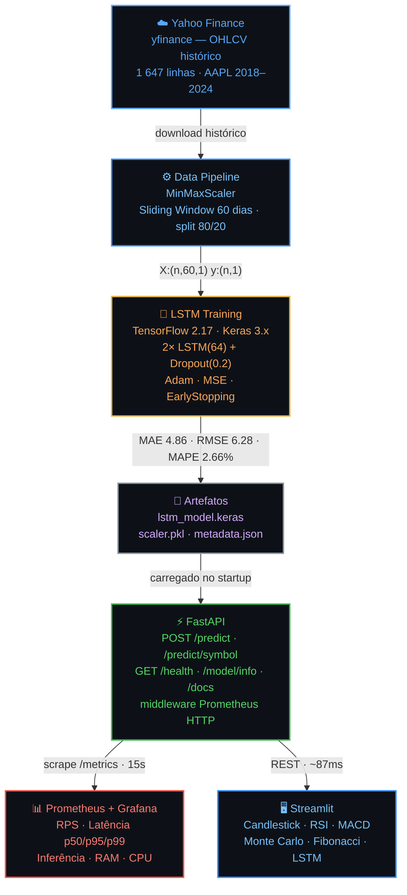
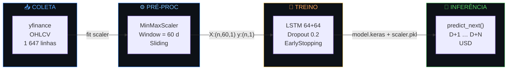
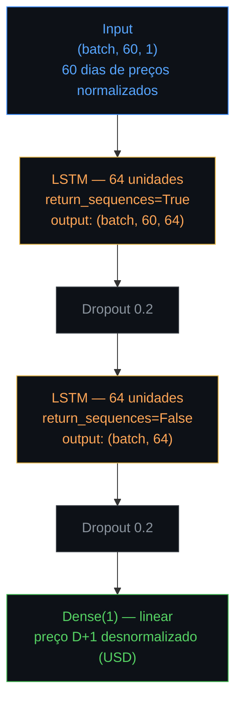

<div align="center">

<br/>

```
██╗     ███████╗████████╗███╗   ███╗    ███████╗████████╗ ██████╗  ██████╗██╗  ██╗
██║     ██╔════╝╚══██╔══╝████╗ ████║    ██╔════╝╚══██╔══╝██╔═══██╗██╔════╝██║ ██╔╝
██║     ███████╗   ██║   ██╔████╔██║    ███████╗   ██║   ██║   ██║██║     █████╔╝
██║     ╚════██║   ██║   ██║╚██╔╝██║    ╚════██║   ██║   ██║   ██║██║     ██╔═██╗
███████╗███████║   ██║   ██║ ╚═╝ ██║    ███████║   ██║   ╚██████╔╝╚██████╗██║  ██╗
╚══════╝╚══════╝   ╚═╝   ╚═╝     ╚═╝    ╚══════╝   ╚═╝    ╚═════╝  ╚═════╝╚═╝  ╚═╝
```

### **Previsão de Preços de Ações com Deep Learning**

*PosTech · Machine Learning Engineering · FIAP · Tech Challenge Fase 4*

<br/>

<!-- STATUS BADGES -->
[](https://pos-tech-mlet-fase-4.onrender.com/health)&nbsp;
[](https://lstm-stock-dashboard.onrender.com)&nbsp;
[](https://pos-tech-mlet-fase-4.onrender.com/docs)

<!-- TECH BADGES -->
[](https://python.org)&nbsp;
[](https://tensorflow.org)&nbsp;
[](https://keras.io)&nbsp;
[](https://fastapi.tiangolo.com)&nbsp;
[](https://streamlit.io)&nbsp;
[](https://docker.com)&nbsp;
[](https://prometheus.io)&nbsp;
[](https://grafana.com)&nbsp;
[](LICENSE)

<br/>

| | |
|:---:|:---:|
| [🖥️ **Dashboard ao Vivo**](https://lstm-stock-dashboard.onrender.com) | [⚡ **API REST**](https://pos-tech-mlet-fase-4.onrender.com) |
| [📖 **Swagger UI**](https://pos-tech-mlet-fase-4.onrender.com/docs) | [🎬 **Vídeo Demo**](https://drive.google.com/drive/folders/13oh-1vmyH5aKzemD9ClMUIB7JU9LFkaa?usp=sharing) |

<br/>

</div>

---

<!-- METRICS CALLOUT -->
<div align="center">

### Modelo AAPL · Jan/2018 – Jul/2024 · LSTM 64+64 · Janela 60 dias

<table>
<tr>
<td align="center" width="150">

<br/><sub>Erro Absoluto Médio</sub>
</td>
<td align="center" width="150">

<br/><sub>Raiz do Erro Quadrático</sub>
</td>
<td align="center" width="150">

<br/><sub>Erro Percentual Médio</sub>
</td>
<td align="center" width="150">

<br/><sub>100 − MAPE</sub>
</td>
</tr>
</table>

</div>

---

## 💡 O Projeto

Sistema **end-to-end de Deep Learning** para previsão do preço de fechamento de ações. Dados reais do Yahoo Finance, modelo LSTM treinado com TensorFlow 2.17, API REST em produção no Render e dashboard interativo de trading.

> **100% dados reais** — Yahoo Finance via proxy integrado à API. Sem fallback sintético, sem dados fabricados.

<br/>

<table>
<tr>
<td valign="top" width="50%">

**⚡ API REST — FastAPI**

```
POST /predict          → previsão por preços
POST /predict/symbol   → previsão por símbolo
GET  /health           → status do sistema
GET  /model/info       → métricas e metadados
GET  /metrics          → Prometheus scrape
GET  /docs             → Swagger UI
GET  /api/chart/{sym}  → proxy Yahoo Finance
```

</td>
<td valign="top" width="50%">

**🖥️ Dashboard — Streamlit**

```
📈 Candlestick OHLCV em tempo real
📉 RSI · MACD · Bollinger Bands
🌀 Fibonacci Retracement Levels
🎲 Simulação Monte Carlo
🗓️ Heatmap sazonal de retornos
🧠 Previsões LSTM D+1 a D+5
```

</td>
</tr>
</table>

---

## 🚀 Quick Start

```bash
# 1. Clone o repositório
git clone https://github.com/dionebraga/Pos_Tech_MLET-Fase-4.git && cd tech-challenge-fase4

# 2. Suba toda a stack com um comando
docker-compose up -d
```

<table>
<tr>
<th>Serviço</th>
<th>Local</th>
<th>Produção</th>
</tr>
<tr>
<td>⚡ API FastAPI</td>
<td><a href="http://localhost:8000">localhost:8000</a></td>
<td><a href="https://pos-tech-mlet-fase-4.onrender.com">pos-tech-mlet-fase-4.onrender.com</a></td>
</tr>
<tr>
<td>📖 Swagger UI</td>
<td><a href="http://localhost:8000/docs">localhost:8000/docs</a></td>
<td><a href="https://pos-tech-mlet-fase-4.onrender.com/docs">.../docs</a></td>
</tr>
<tr>
<td>🖥️ Dashboard</td>
<td><a href="http://localhost:8501">localhost:8501</a></td>
<td><a href="https://lstm-stock-dashboard.onrender.com">lstm-stock-dashboard.onrender.com</a></td>
</tr>
<tr>
<td>📊 Prometheus</td>
<td><a href="http://localhost:9090">localhost:9090</a></td>
<td><em>local only</em></td>
</tr>
<tr>
<td>📈 Grafana</td>
<td><a href="http://localhost:3000">localhost:3000</a> — <code>admin/admin</code></td>
<td><em>local only</em></td>
</tr>
</table>

> ⚠️ **Render Free Tier** — primeira requisição pode levar ~30s para acordar o serviço.

---

## 📋 Índice

| | |
|---|---|
| [🏗️ Arquitetura](#-arquitetura) | [📸 Demonstração](#-demonstração) |
| [📈 Métricas do Modelo](#-métricas-do-modelo) | [⚡ Uso da API](#-uso-da-api) |
| [🛠️ Stack Tecnológica](#-stack-tecnológica) | [📁 Estrutura do Projeto](#-estrutura-do-projeto) |
| [⚙️ Setup Local](#-setup-local) | [🧠 Treinamento](#-treinamento-do-modelo) |
| [🐳 Docker](#-docker) | [📊 Monitoramento](#-monitoramento) |
| [☁️ Deploy](#-deploy-em-nuvem) | [🎬 Vídeo](#-vídeo-demonstrativo) |

---

## 🏗 Arquitetura



### Fluxo de Dados



---

## 📸 Demonstração

<table>
<tr>

<td valign="top" width="50%">

### 🖥️ Trading Terminal

[](https://lstm-stock-dashboard.onrender.com)

Terminal de trading completo com dados reais do Yahoo Finance. Seis módulos de análise integrados:

| Módulo | Indicador |
|--------|-----------|
| 📈 Preço | Candlestick OHLCV |
| 📉 Momentum | RSI 14 · MACD |
| 〰️ Volatilidade | Bollinger Bands |
| 🌀 Suporte | Fibonacci |
| 🎲 Risco | Monte Carlo |
| 🧠 IA | Forecast LSTM |

</td>

<td valign="top" width="50%">

### 📊 Grafana Monitoring

[](http://localhost:3000)

`docker-compose up -d` → `localhost:3000`

| Painel | Fonte |
|--------|-------|
| 🟢 Status do Modelo | `model_loaded` |
| 📈 RPS por endpoint | `http_requests_total` |
| ⏱️ Latência p50/p95/p99 | `http_request_duration_seconds` |
| 🧠 Inferência LSTM ms | `prediction_duration_seconds` |
| 💾 RAM · CPU | `process_*` |
| 💵 Previsões ao vivo | `last_prediction_value` |

</td>

</tr>
</table>

### ⚡ API — Swagger UI

[](https://pos-tech-mlet-fase-4.onrender.com/docs)

---

## 📈 Métricas do Modelo

<div align="center">

> Treinado em **AAPL** · Jan/2018 – Jul/2024 · 15 épocas efetivas (EarlyStopping)

| Métrica | Valor | Benchmark | Barra |
|---------|-------|-----------|-------|
| **MAE** | 4.86 USD | < 5 USD ✅ | `████████████████████░` |
| **RMSE** | 6.28 USD | < 8 USD ✅ | `███████████████░░░░░░` |
| **MAPE** | 2.66% | < 5% ✅ | `██████░░░░░░░░░░░░░░░` |
| **Acurácia** | **97.34%** | > 95% ✅ | `████████████████████░` |

</div>

<details>
<summary><b>📉 Evolução do treino (clique para expandir)</b></summary>

```
 Epoch │ loss (MSE) │ val_loss   │
───────┼────────────┼────────────┤
  10   │  0.001800  │  0.002100  │
  11   │  0.001700  │  0.002000  │
  12   │  0.001600  │  0.002000  │
  13   │  0.001500  │  0.001900  │ ← melhor checkpoint salvo
  14   │  0.001500  │  0.002000  │
  15   │  EarlyStopping (patience=10) → fim do treino
───────┴────────────┴────────────┘

Dataset  │ Amostras │ Período
─────────┼──────────┼───────────
Treino   │  1 269   │ 2018–2022
Teste    │    318   │ 2022–2024
Total    │  1 647   │ 2018–2024
```

</details>

Métricas ao vivo: [`/model/info`](https://pos-tech-mlet-fase-4.onrender.com/model/info)

---

## ⚡ Uso da API

### Endpoints

<table>
<tr><th>Método</th><th>Endpoint</th><th>Descrição</th></tr>
<tr><td><code>GET</code></td><td><a href="https://pos-tech-mlet-fase-4.onrender.com/"><code>/</code></a></td><td>Dashboard HTML da API</td></tr>
<tr><td><code>GET</code></td><td><a href="https://pos-tech-mlet-fase-4.onrender.com/health"><code>/health</code></a></td><td>Status do sistema e modelo</td></tr>
<tr><td><code>GET</code></td><td><a href="https://pos-tech-mlet-fase-4.onrender.com/model/info"><code>/model/info</code></a></td><td>Arquitetura, métricas e metadados do modelo</td></tr>
<tr><td><code>POST</code></td><td><code>/predict</code></td><td>Previsão a partir de histórico de preços fornecido</td></tr>
<tr><td><code>POST</code></td><td><code>/predict/symbol</code></td><td>Previsão buscando dados do Yahoo Finance automaticamente</td></tr>
<tr><td><code>GET</code></td><td><a href="https://pos-tech-mlet-fase-4.onrender.com/api/chart/AAPL"><code>/api/chart/{symbol}</code></a></td><td>Proxy OHLCV do Yahoo Finance</td></tr>
<tr><td><code>GET</code></td><td><a href="https://pos-tech-mlet-fase-4.onrender.com/metrics"><code>/metrics</code></a></td><td>Métricas Prometheus (scrape target)</td></tr>
<tr><td><code>GET</code></td><td><a href="https://pos-tech-mlet-fase-4.onrender.com/docs"><code>/docs</code></a></td><td>Swagger UI interativo</td></tr>
</table>

<br/>

<details>
<summary><b>▶ Previsão por símbolo (recomendado)</b></summary>

```bash
curl -X POST "https://pos-tech-mlet-fase-4.onrender.com/predict/symbol" \
  -H "Content-Type: application/json" \
  -d '{"symbol": "AAPL", "days_ahead": 5}'
```

```json
{
  "symbol": "AAPL",
  "last_close": 178.45,
  "last_close_date": "2024-07-19",
  "predictions": [
    {"day": 1, "predicted_price": 179.12},
    {"day": 2, "predicted_price": 180.05},
    {"day": 3, "predicted_price": 180.88},
    {"day": 4, "predicted_price": 181.42},
    {"day": 5, "predicted_price": 181.95}
  ],
  "inference_time_ms": 87.3
}
```

</details>

<details>
<summary><b>▶ Previsão por histórico customizado</b></summary>

```bash
curl -X POST "https://pos-tech-mlet-fase-4.onrender.com/predict" \
  -H "Content-Type: application/json" \
  -d '{"close_prices": [170.1, 171.5, 172.3, ...], "days_ahead": 3}'
```

> Mínimo de **60 valores** de fechamento em ordem cronológica (mais antigo → mais recente).

</details>

<details>
<summary><b>▶ Health check</b></summary>

```bash
curl https://pos-tech-mlet-fase-4.onrender.com/health
```

```json
{
  "status": "ok",
  "model_loaded": true,
  "uptime_seconds": 3842,
  "symbol": "AAPL",
  "window_size": 60
}
```

</details>

---

## 🛠 Stack Tecnológica

<div align="center">

**Core ML**


**API & Dashboard**


**Infra & Monitoring**


</div>

---

## 📁 Estrutura do Projeto

<details>
<summary><b>📂 Expandir árvore de arquivos</b></summary>

```
tech-challenge-fase4/
│
├── 🐳 Dockerfile                      # Container da API
├── 🐳 Dockerfile.dashboard            # Container do Dashboard
├── 🐳 docker-compose.yml              # Stack completa (API + Dashboard + Prometheus + Grafana)
├── ☁️  render.yaml                     # Blueprint Render (2 serviços)
├── 📦 requirements.txt                # Dependências completas
├── 📦 requirements-api.txt            # Subset mínimo para API em produção
├── 📦 requirements-dashboard.txt      # Subset para Dashboard
├── 🖥️  dashboard.py                    # Streamlit — Trading Terminal
│
├── src/
│   ├── config.py                      # Configurações centralizadas (Pydantic Settings)
│   ├── data_loader.py                 # Coleta de dados via yfinance 1.x
│   ├── preprocessor.py               # MinMaxScaler + janelas deslizantes
│   ├── model.py                       # Arquitetura LSTM (keras)
│   ├── train.py                       # Pipeline de treinamento completo
│   ├── evaluate.py                    # Métricas: MAE, RMSE, MAPE
│   ├── predict.py                     # StockPredictor — inferência
│   └── api/
│       ├── main.py                    # FastAPI app + lifespan + middleware HTTP
│       ├── schemas.py                 # Pydantic v2 request/response models
│       ├── routes.py                  # Endpoints + proxy Yahoo Finance
│       └── monitoring.py             # Contadores/Histogramas/Gauges Prometheus
│
├── notebooks/
│   └── 01_exploracao_e_treino.ipynb   # EDA completo + treinamento passo a passo
│
├── models/
│   ├── lstm_model.keras               # Modelo serializado (Keras native format)
│   ├── scaler.pkl                     # MinMaxScaler fitted (joblib)
│   └── metadata.json                  # Hiperparâmetros + métricas do treino
│
├── monitoring/
│   ├── prometheus.yml                 # Scrape targets: prod + local
│   └── grafana/
│       ├── dashboards/api_dashboard.json
│       └── provisioning/              # Auto-provisioning datasources + dashboards
│
├── data/
│   └── AAPL_2018_2024.csv            # Cache histórico (1 647 linhas)
│
├── scripts/
│   ├── download_model.py              # Download do modelo via HuggingFace Hub
│   ├── run_training.sh                # Script de treino parametrizado
│   └── run_api.sh                     # Script de inicialização da API
│
└── tests/
    ├── test_api.py                    # Testes de integração dos endpoints
    ├── test_data_loader.py            # Testes unitários do data loader
    └── test_preprocessor.py          # Testes do pipeline de pré-processamento
```

</details>

---

## ⚙️ Setup Local

### Pré-requisitos


<details>
<summary><b>🐍 Apenas a API (sem Docker)</b></summary>

```bash
# 1. Clone
git clone https://github.com/dionebraga/Pos_Tech_MLET-Fase-4.git
cd tech-challenge-fase4

# 2. Virtualenv
python -m venv venv
source venv/bin/activate        # Linux / macOS
# venv\Scripts\activate         # Windows PowerShell

# 3. Dependências
pip install -r requirements.txt

# 4. Inicia a API
uvicorn src.api.main:app --reload --host 0.0.0.0 --port 8000
```

Acesse: [http://localhost:8000/docs](http://localhost:8000/docs)

</details>

<details>
<summary><b>🖥️ Dashboard local</b></summary>

```bash
# Aponte para a API local
export API_URL=http://localhost:8000          # Linux / macOS
# $env:API_URL="http://localhost:8000"        # Windows PowerShell

streamlit run dashboard.py
```

Acesse: [http://localhost:8501](http://localhost:8501)

</details>

<details>
<summary><b>🐳 Stack completa com Docker</b></summary>

```bash
docker-compose up -d

# Acompanhar logs
docker-compose logs -f api

# Parar tudo
docker-compose down
```

</details>

---

## 🧠 Treinamento do Modelo

```bash
# Treino padrão (AAPL, 2018–2024)
python -m src.train

# Customizado
python -m src.train --symbol PETR4.SA --start 2019-01-01 --end 2024-12-31 --epochs 50
```

### Arquitetura LSTM



### Pipeline de Treinamento

```mermaid
flowchart LR
    S1["1️⃣ Download\nyfinance OHLCV\n1 647 linhas"]
    S2["2️⃣ Normalização\nMinMaxScaler\nfit em treino"]
    S3["3️⃣ Janelamento\n60 dias → D+1\nsliding window"]
    S4["4️⃣ Split\n80% treino\n20% teste"]
    S5["5️⃣ Treino\nAdam lr=0.001\nMSE loss"]
    S6["6️⃣ Avaliação\nMAE · RMSE\nMAPE"]
    S7["7️⃣ Serialização\nmodel.keras\nscaler.pkl"]

    S1 --> S2 --> S3 --> S4 --> S5 --> S6 --> S7

    style S1 fill:#0d1117,color:#58a6ff,stroke:#388bfd
    style S2 fill:#0d1117,color:#79c0ff,stroke:#388bfd
    style S3 fill:#0d1117,color:#79c0ff,stroke:#388bfd
    style S4 fill:#0d1117,color:#d2a8ff,stroke:#8b949e
    style S5 fill:#0d1117,color:#ffa657,stroke:#e3b341
    style S6 fill:#0d1117,color:#ffa657,stroke:#e3b341
    style S7 fill:#0d1117,color:#56d364,stroke:#3fb950
```



---

## 🐳 Docker

```bash
# Apenas a API
docker build -t lstm-stock-api .
docker run -p 8000:8000 lstm-stock-api

# Apenas o Dashboard
docker build -f Dockerfile.dashboard -t lstm-stock-dashboard .
docker run -p 8501:8501 -e API_URL=http://host.docker.internal:8000 lstm-stock-dashboard

# Stack completa (recomendado)
docker-compose up -d
docker-compose logs -f api          # acompanhar logs da API
docker-compose restart grafana      # recarregar dashboard Grafana
```

---

## 📊 Monitoramento

A API expõe métricas em [`/metrics`](https://pos-tech-mlet-fase-4.onrender.com/metrics):

| Métrica | Tipo | Descrição |
|---------|------|-----------|
| `http_requests_total` | Counter | Requisições por método, handler e status HTTP |
| `http_request_duration_seconds` | Histogram | Latência completa de cada requisição |
| `predictions_total` | Counter | Previsões por endpoint e status (success/error) |
| `prediction_duration_seconds` | Histogram | Tempo de inferência do modelo LSTM |
| `last_prediction_value` | Gauge | Último preço previsto por símbolo (USD) |
| `model_loaded` | Gauge | `1` = modelo ativo · `0` = degradado |
| `process_resident_memory_bytes` | Gauge | Uso de RAM |
| `process_cpu_seconds_total` | Counter | Uso acumulado de CPU |

<details>
<summary><b>📟 Queries Prometheus úteis</b></summary>

```promql
# Taxa de requisições por endpoint
sum by (handler) (rate(http_requests_total[1m]))

# Latência p99
histogram_quantile(0.99, sum by (le) (rate(http_request_duration_seconds_bucket[5m])))

# Tempo médio de inferência em ms
rate(prediction_duration_seconds_sum[2m]) / rate(prediction_duration_seconds_count[2m]) * 1000

# Última previsão por símbolo
max by (symbol) (last_prediction_value)

# Status do modelo
max(model_loaded)
```

</details>

---

## ☁️ Deploy em Nuvem

O projeto usa **Render** com dois serviços definidos em `render.yaml`:

<table>
<tr>
<th>Serviço</th>
<th>Runtime</th>
<th>URL de Produção</th>
</tr>
<tr>
<td>⚡ API FastAPI</td>
<td>Docker</td>
<td><a href="https://pos-tech-mlet-fase-4.onrender.com">pos-tech-mlet-fase-4.onrender.com</a></td>
</tr>
<tr>
<td>🖥️ Dashboard Streamlit</td>
<td>Docker</td>
<td><a href="https://lstm-stock-dashboard.onrender.com">lstm-stock-dashboard.onrender.com</a></td>
</tr>
</table>

<details>
<summary><b>☁️ Como fazer deploy no Render</b></summary>

1. Fork o repositório no GitHub
2. Acesse [render.com](https://render.com) → **New** → **Blueprint**
3. Aponte para o `render.yaml` do repositório
4. Configure a variável `API_URL` no serviço do Dashboard:
   ```
   API_URL=https://pos-tech-mlet-fase-4.onrender.com
   ```
5. Render detecta os Dockerfiles e inicia o deploy automaticamente

</details>

---

## 🎬 Vídeo Demonstrativo

[](https://drive.google.com/drive/folders/13oh-1vmyH5aKzemD9ClMUIB7JU9LFkaa?usp=sharing)

O vídeo demonstra:
- Arquitetura geral do sistema end-to-end
- Dashboard de trading em tempo real com dados reais
- Endpoints da API via Swagger UI
- Métricas do modelo LSTM e precisão das previsões
- Stack de monitoramento: Prometheus + Grafana

---

## 👤 Autor

<table>
<tr>
<td>

**Dione Braga Ferreira**

Pós-Graduação em Machine Learning Engineering — FIAP

Tech Challenge Fase 4 · 2026

[](https://github.com/dionebraga)
[](mailto:dionebraga.work@gmail.com)

</td>
</tr>
</table>

---

<div align="center">

<br/>

[](https://github.com/dionebraga/Pos_Tech_MLET-Fase-4)&nbsp;
[](https://lstm-stock-dashboard.onrender.com)&nbsp;
[](https://pos-tech-mlet-fase-4.onrender.com)&nbsp;
[](https://pos-tech-mlet-fase-4.onrender.com/docs)&nbsp;
[](https://drive.google.com/drive/folders/13oh-1vmyH5aKzemD9ClMUIB7JU9LFkaa?usp=sharing)

<br/>

*Feito com ❤️ usando TensorFlow · FastAPI · Streamlit · Prometheus · Grafana*

**© 2026 Dione Braga Ferreira** · MIT License

<br/>

</div>
