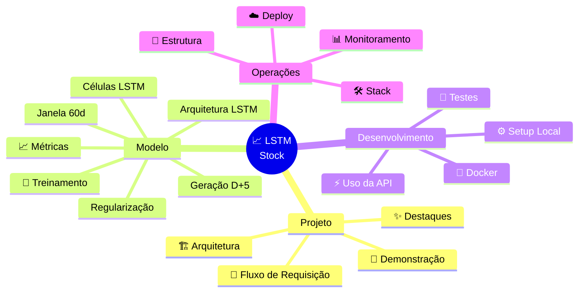
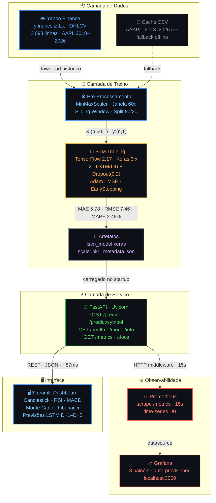
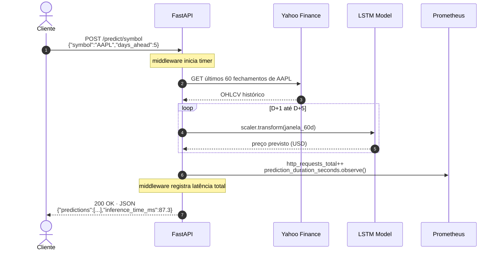
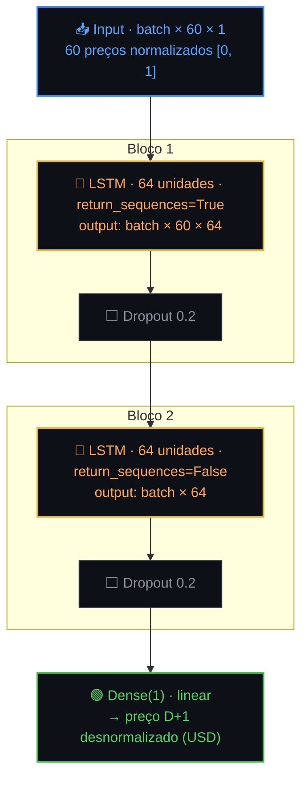
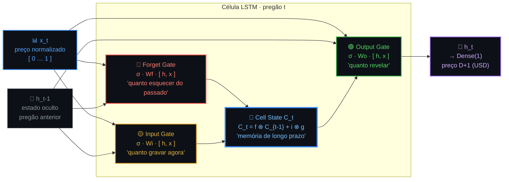
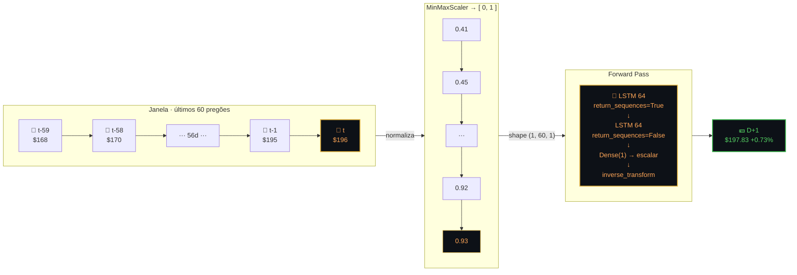
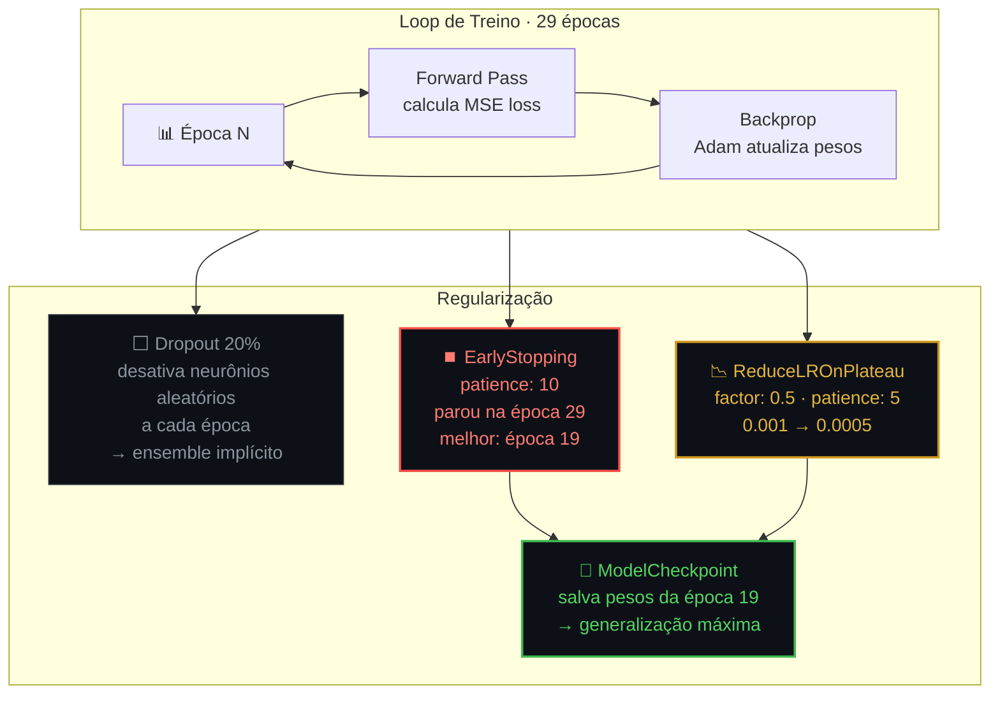

<div align="center">

<br/>

```
██╗     ███████╗████████╗███╗   ███╗    ███████╗████████╗ ██████╗  ██████╗██╗  ██╗
██║     ██╔════╝╚══██╔══╝████╗ ████║    ██╔════╝╚══██╔══╝██╔═══██╗██╔════╝██║ ██╔╝
██║     ███████╗   ██║   ██╔████╔██║    ███████╗   ██║   ██║   ██║██║     █████╔╝
██║     ╚════██║   ██║   ██║╚██╔╝██║    ╚════██║   ██║   ██║   ██║██║     ██╔═██╗
███████╗███████║   ██║   ██║ ╚═╝ ██║    ███████║   ██║   ╚██████╔╝╚██████╗██║  ██╗
╚══════╝╚══════╝   ╚═╝   ╚═╝     ╚═╝    ╚══════╝   ╚═╝    ╚═════╝  ╚═════╝╚═╝  ╚═╝
```

**Previsão de Preços de Ações com Deep Learning · End-to-End**

*PosTech · Machine Learning Engineering · FIAP · Tech Challenge Fase 4*

<br/>

[](https://pos-tech-mlet-fase-4.onrender.com/health)
[](https://lstm-stock-dashboard.onrender.com)
[](https://pos-tech-mlet-fase-4.onrender.com/docs)
[](https://drive.google.com/drive/folders/13oh-1vmyH5aKzemD9ClMUIB7JU9LFkaa?usp=sharing)

<br/>

[](https://python.org)
[](https://tensorflow.org)
[](https://keras.io)
[](https://fastapi.tiangolo.com)
[](https://streamlit.io)
[](https://docker.com)
[](https://prometheus.io)
[](https://grafana.com)
[](LICENSE)

<br/>

| [🖥️ **Dashboard**](https://lstm-stock-dashboard.onrender.com) | [⚡ **API REST**](https://pos-tech-mlet-fase-4.onrender.com) | [📖 **Swagger UI**](https://pos-tech-mlet-fase-4.onrender.com/docs) | [🎬 **Vídeo Demo**](https://drive.google.com/drive/folders/13oh-1vmyH5aKzemD9ClMUIB7JU9LFkaa?usp=sharing) |
|:---:|:---:|:---:|:---:|

</div>

<br/>

> **100% dados reais** — Yahoo Finance via proxy integrado. Modelo LSTM 2 camadas treinado em 6 anos de histórico. API + Dashboard + Monitoramento em produção no Render.

<br/>

<div align="center">

<!--  M É T R I C A S  -->

<table>
<tr>
<td align="center" width="160">
  <br/>
  <sub><b>Erro Absoluto Médio</b></sub>
</td>
<td align="center" width="160">
  <br/>
  <sub><b>Raiz do Erro Quadrático</b></sub>
</td>
<td align="center" width="160">
  <br/>
  <sub><b>Erro Percentual Médio</b></sub>
</td>
<td align="center" width="160">
  <br/>
  <sub><b>100 − MAPE</b></sub>
</td>
<td align="center" width="160">
  <br/>
  <sub><b>Latência da API</b></sub>
</td>
</tr>
</table>

*AAPL · Jan 2018 – Abr 2026 · LSTM 64+64 · Janela 60 dias · 29 épocas (EarlyStopping)*

</div>

---

## ✨ Destaques do Projeto

<br/>

<table>
<tr>

<td align="center" valign="top" width="25%">

### 🧠
**Deep Learning Real**

Rede LSTM 2 camadas treinada em série temporal histórica real, com split temporal correto (sem data leakage), EarlyStopping e validação por MAPE

</td>

<td align="center" valign="top" width="25%">

### 🚀
**Pronto para Produção**

API containerizada (Docker), deploy automático no Render, lifespan handler, logging estruturado, tratamento de erros e health checks em todos os endpoints

</td>

<td align="center" valign="top" width="25%">

### 📊
**Observabilidade Total**

Middleware HTTP que registra RPS, latência p50/p95/p99, tempo de inferência, RAM e CPU — 8 painéis pré-configurados no Grafana via Prometheus

</td>

<td align="center" valign="top" width="25%">

### 🖥️
**Terminal de Trading**

Dashboard Streamlit com 7 módulos: Candlestick, RSI, MACD, Bollinger Bands, Fibonacci, Monte Carlo e previsões LSTM D+1 a D+5 em tempo real

</td>

</tr>
</table>

---

## 🚀 Quick Start

<table>
<tr>
<td align="center" width="30%">
<br/>
<b>📥 Passo 1 — Clone</b><br/><br/>
<code>git clone https://github.com/dionebraga/Pos_Tech_MLET-Fase-4.git</code><br/>
<code>cd tech-challenge-fase4</code><br/><br/>
<sub><i>~5 segundos</i></sub>
</td>
<td align="center" width="5%"><b>→</b></td>
<td align="center" width="34%">
<br/>
<b>🐳 Passo 2 — Subir Stack</b><br/><br/>
<code>docker-compose up -d</code><br/><br/>
<sub><i>~2 minutos · API + Dashboard + Prometheus + Grafana</i></sub>
</td>
<td align="center" width="5%"><b>→</b></td>
<td align="center" width="26%">
<br/>
<b>🎉 Passo 3 — Pronto!</b><br/><br/>
<a href="http://localhost:8000/docs"><code>localhost:8000/docs</code></a><br/>
<a href="http://localhost:8501"><code>localhost:8501</code></a><br/><br/>
<sub><i>Swagger UI + Dashboard live</i></sub>
</td>
</tr>
</table>

```bash
git clone https://github.com/dionebraga/Pos_Tech_MLET-Fase-4.git
cd tech-challenge-fase4
docker-compose up -d
```

<br/>

<table>
<tr>
<th align="center">Serviço</th>
<th align="center">🖥️ Local</th>
<th align="center">☁️ Produção</th>
</tr>
<tr>
<td>⚡ <b>API FastAPI</b></td>
<td><a href="http://localhost:8000">localhost:8000</a></td>
<td><a href="https://pos-tech-mlet-fase-4.onrender.com">pos-tech-mlet-fase-4.onrender.com</a></td>
</tr>
<tr>
<td>📖 <b>Swagger UI</b></td>
<td><a href="http://localhost:8000/docs">localhost:8000/docs</a></td>
<td><a href="https://pos-tech-mlet-fase-4.onrender.com/docs">.../docs</a></td>
</tr>
<tr>
<td>🖥️ <b>Dashboard</b></td>
<td><a href="http://localhost:8501">localhost:8501</a></td>
<td><a href="https://lstm-stock-dashboard.onrender.com">lstm-stock-dashboard.onrender.com</a></td>
</tr>
<tr>
<td>📊 <b>Prometheus</b></td>
<td><a href="http://localhost:9090">localhost:9090</a></td>
<td><em>local only</em></td>
</tr>
<tr>
<td>📈 <b>Grafana</b></td>
<td><a href="http://localhost:3000">localhost:3000</a> · <code>admin / admin</code></td>
<td><em>local only</em></td>
</tr>
</table>

> ⚠️ **Render Free Tier** — primeira requisição pode levar ~30 s (cold start do container).

---

## 🗺️ Índice



---

## 🏗 Arquitetura



---

## 🔄 Fluxo de Requisição



---

## 📸 Demonstração

<table>
<tr>

<td valign="top" width="50%">

### 🖥️ Trading Terminal

[](https://lstm-stock-dashboard.onrender.com)

Terminal de trading completo com dados reais do Yahoo Finance. Atualização automática a cada sessão.

| # | Módulo | Indicador |
|---|--------|-----------|
| 1 | 📈 Preço | Candlestick OHLCV |
| 2 | 📉 Momentum | RSI 14 · MACD |
| 3 | 〰️ Volatilidade | Bollinger Bands |
| 4 | 🌀 Suporte | Fibonacci |
| 5 | 🎲 Cenários | Monte Carlo |
| 6 | 🗓️ Sazonalidade | Heatmap mensal |
| 7 | 🧠 IA | Forecast LSTM |

</td>

<td valign="top" width="50%">

### 📊 Grafana Monitoring

[](http://localhost:3000)

8 painéis pré-configurados — provisioning automático no startup.

| # | Painel | Query |
|---|--------|-------|
| 1 | 🟢 Status Modelo | `max(model_loaded)` |
| 2 | 📈 RPS | `rate(http_requests_total[1m])` |
| 3 | ⏱️ Latência p50/95/99 | `histogram_quantile(...)` |
| 4 | 🧠 Inferência ms | `rate(prediction_duration...)` |
| 5 | 💾 RAM | `process_resident_memory_bytes` |
| 6 | 🖥️ CPU | `process_cpu_seconds_total` |
| 7 | 🔢 Previsões | `predictions_total` |
| 8 | 💵 Últimos preços | `last_prediction_value` |

</td>

</tr>
</table>

### ⚡ API — Swagger UI Interativo

[](https://pos-tech-mlet-fase-4.onrender.com/docs)

---

## 📈 Métricas do Modelo

```
  AAPL · Jan 2018 – Abr 2026 · LSTM 64+64 · 29 épocas · janela 60 dias
  ────────────────────────────────────────────────────────────────────
  MAE    ▓▓▓▓▓▓▓▓▓▓▓▓▓▓▓▓▓░░░░░░░░░░░░░   5.78 USD  ✅  bench < 6.0
  RMSE   ▓▓▓▓▓▓▓▓▓▓▓▓▓▓▓▓▓▓▓▓▓▓░░░░░░░░   7.46 USD  ✅  bench < 8.0
  MAPE   ▓▓▓▓▓▓▓░░░░░░░░░░░░░░░░░░░░░░░   2.48  %   ✅  bench < 5.0
  Acc    ▓▓▓▓▓▓▓▓▓▓▓▓▓▓▓▓▓▓▓▓▓▓▓▓▓▓▓▓▓░  97.52  %   ✅  bench > 95
  ────────────────────────────────────────────────────────────────────
  Escala: MAE/RMSE/MAPE em 0–10 · Acurácia em 0–100 · ▓ = preenchido
```

<div align="center">

| Métrica | Valor | Benchmark | |
|---------|:-----:|:---------:|:---:|
| **MAE** | **5.78 USD** | < 6 USD | ✅ |
| **RMSE** | **7.46 USD** | < 8 USD | ✅ |
| **MAPE** | **2.48%** | < 5% | ✅ |
| **Acurácia** | **97.52%** | > 95% | ✅ |

</div>

<details>
<summary><b>📉 Curva de aprendizado completa + split do dataset</b></summary>

```
 Época  loss (MSE)   val_loss    Δ
──────┬────────────┬────────────┬────────────────
  01  │  0.004800  │  0.004500  │ ↓ aprendendo
  05  │  0.002700  │  0.002900  │ ↓ convergindo
  10  │  0.001700  │  0.002000  │ ↓ refinando
  15  │  0.001400  │  0.001800  │ ↓
  18  │  0.001300  │  0.001700  │ ↓
  19  │  0.001250  │  0.001650  │ ✅ melhor checkpoint salvo
  24  │  0.001200  │  0.001700  │ ↑ leve overfitting
  29  │      EarlyStopping (patience=10) disparado
──────┴────────────┴────────────┴────────────────

  Split   Amostras   Período      Proporção
─────────┬──────────┬─────────────┬──────────
 Treino  │  1 626   │  2018–2023  │   80 %
 Teste   │    407   │  2023–2026  │   20 %
 Total   │  2 093   │  2018–2026  │  100 %
```

</details>

Métricas ao vivo: [`/model/info`](https://pos-tech-mlet-fase-4.onrender.com/model/info)

---

## ⚡ Uso da API

<table>
<tr><th>Método</th><th>Endpoint</th><th>Descrição</th></tr>
<tr><td></td>
    <td><a href="https://pos-tech-mlet-fase-4.onrender.com/"><code>/</code></a></td>
    <td>Dashboard HTML embutido</td></tr>
<tr><td></td>
    <td><a href="https://pos-tech-mlet-fase-4.onrender.com/health"><code>/health</code></a></td>
    <td>Status detalhado do sistema e modelo</td></tr>
<tr><td></td>
    <td><a href="https://pos-tech-mlet-fase-4.onrender.com/model/info"><code>/model/info</code></a></td>
    <td>Arquitetura, hiperparâmetros e métricas</td></tr>
<tr><td></td>
    <td><code>/predict</code></td>
    <td>Previsão via array de preços fornecido</td></tr>
<tr><td></td>
    <td><code>/predict/symbol</code></td>
    <td>Previsão via símbolo — busca automática no Yahoo Finance</td></tr>
<tr><td></td>
    <td><a href="https://pos-tech-mlet-fase-4.onrender.com/api/chart/AAPL"><code>/api/chart/{symbol}</code></a></td>
    <td>Proxy OHLCV do Yahoo Finance</td></tr>
<tr><td></td>
    <td><a href="https://pos-tech-mlet-fase-4.onrender.com/metrics"><code>/metrics</code></a></td>
    <td>Métricas Prometheus (scrape endpoint)</td></tr>
<tr><td></td>
    <td><a href="https://pos-tech-mlet-fase-4.onrender.com/docs"><code>/docs</code></a></td>
    <td>Swagger UI interativo (OpenAPI 3.1)</td></tr>
</table>

<details>
<summary><b>🐚 cURL — Previsão por símbolo</b></summary>

```bash
curl -X POST "https://pos-tech-mlet-fase-4.onrender.com/predict/symbol" \
  -H "Content-Type: application/json" \
  -d '{"symbol": "AAPL", "days_ahead": 5}'
```

```json
{
  "symbol": "AAPL",
  "last_close": 178.45,
  "last_close_date": "2026-04-30",
  "predictions": [
    {"day": 1, "predicted_price": 179.12},
    {"day": 2, "predicted_price": 180.05},
    {"day": 3, "predicted_price": 180.88},
    {"day": 4, "predicted_price": 181.42},
    {"day": 5, "predicted_price": 181.95}
  ],
  "inference_time_ms": 87.3
}
```

</details>

<details>
<summary><b>🐍 Python</b></summary>

```python
import requests

r = requests.post(
    "https://pos-tech-mlet-fase-4.onrender.com/predict/symbol",
    json={"symbol": "AAPL", "days_ahead": 5},
)
data = r.json()
for p in data["predictions"]:
    print(f"D+{p['day']}: $ {p['predicted_price']:.2f}")
# D+1: $ 179.12
# D+2: $ 180.05
# D+3: $ 180.88
```

</details>

<details>
<summary><b>🌐 JavaScript / fetch</b></summary>

```javascript
const res = await fetch("https://pos-tech-mlet-fase-4.onrender.com/predict/symbol", {
  method: "POST",
  headers: { "Content-Type": "application/json" },
  body: JSON.stringify({ symbol: "AAPL", days_ahead: 5 }),
});
const { predictions, inference_time_ms } = await res.json();
console.log(`D+1: $${predictions[0].predicted_price} · ${inference_time_ms}ms`);
```

</details>

<details>
<summary><b>💚 Health check</b></summary>

```bash
curl https://pos-tech-mlet-fase-4.onrender.com/health
```

```json
{ "status": "ok", "model_loaded": true, "uptime_seconds": 3842,
  "symbol": "AAPL", "window_size": 60 }
```

</details>

---

## 🛠 Stack Tecnológica

<div align="center">

**🧠 Core ML & Data**


**🚀 API & Dashboard**


**☁️ Infra, Observabilidade & Deploy**


</div>

---

## 📁 Estrutura do Projeto

<details>
<summary><b>📂 Ver árvore de arquivos completa</b></summary>

```
tech-challenge-fase4/
│
├── 🐳 Dockerfile                      # Container da API (produção)
├── 🐳 Dockerfile.dashboard            # Container do Dashboard
├── 🐳 docker-compose.yml              # Stack completa — 4 serviços
├── ☁️  render.yaml                     # Blueprint Render — 2 serviços
├── 📦 requirements.txt                # Dependências completas
├── 📦 requirements-api.txt            # Subset mínimo para API
├── 📦 requirements-dashboard.txt      # Subset para Dashboard
├── 🖥️  dashboard.py                    # Streamlit — Trading Terminal
│
├── src/
│   ├── config.py                      # Pydantic Settings · env vars
│   ├── data_loader.py                 # yfinance 1.x · OHLCV
│   ├── preprocessor.py               # MinMaxScaler · sliding windows
│   ├── model.py                       # Arquitetura LSTM (Keras)
│   ├── train.py                       # Pipeline de treinamento
│   ├── evaluate.py                    # MAE · RMSE · MAPE
│   ├── predict.py                     # StockPredictor · inferência
│   └── api/
│       ├── main.py                    # FastAPI app + lifespan + HTTP middleware
│       ├── schemas.py                 # Pydantic v2 · request/response
│       ├── routes.py                  # Endpoints + proxy Yahoo Finance
│       └── monitoring.py             # Prometheus counters/histograms/gauges
│
├── notebooks/
│   └── 01_exploracao_e_treino.ipynb   # EDA completo + treino passo a passo
│
├── models/                            # Artefatos serializados
│   ├── lstm_model.keras
│   ├── scaler.pkl
│   └── metadata.json
│
├── monitoring/
│   ├── prometheus.yml                 # Scrape targets: prod + local
│   └── grafana/
│       ├── dashboards/api_dashboard.json
│       └── provisioning/             # Auto-provisioning
│
├── data/
│   └── AAPL_2018_2026.csv            # Cache histórico · 2 093 linhas
│
└── tests/
    ├── test_api.py                    # Integração · endpoints
    ├── test_data_loader.py            # Unit · data loader
    └── test_preprocessor.py          # Unit · preprocessor
```

</details>

---

## ⚙️ Setup Local

<details>
<summary><b>🐍 Apenas a API (sem Docker)</b></summary>

```bash
git clone https://github.com/dionebraga/Pos_Tech_MLET-Fase-4.git
cd tech-challenge-fase4

python -m venv venv
source venv/bin/activate          # Linux / macOS
# venv\Scripts\activate           # Windows PowerShell

pip install -r requirements.txt
uvicorn src.api.main:app --reload --host 0.0.0.0 --port 8000
# → http://localhost:8000/docs
```

</details>

<details>
<summary><b>🖥️ Dashboard local</b></summary>

```bash
export API_URL=http://localhost:8000          # Linux / macOS
# $env:API_URL="http://localhost:8000"        # Windows PowerShell

streamlit run dashboard.py   # → http://localhost:8501
```

</details>

<details>
<summary><b>🐳 Stack completa com Docker Compose</b></summary>

```bash
docker-compose up -d                   # Sobe tudo
docker-compose logs -f api             # Logs da API
docker-compose restart grafana         # Recarregar dashboards
docker-compose down                    # Para tudo
```

</details>

---

## 🧠 Treinamento do Modelo

```bash
python -m src.train                                                      # padrão: AAPL 2018–2026
python -m src.train --symbol PETR4.SA --start 2019-01-01 --end 2026-05-01 --epochs 50
```

### Arquitetura da Rede Neural



### Pipeline de Treinamento

<table>
<tr>
<td align="center" width="14%"><b>1️⃣</b><br/><b>Download</b><br/><sub>yfinance OHLCV<br/>2 093 linhas</sub></td>
<td align="center" width="2%">→</td>
<td align="center" width="14%"><b>2️⃣</b><br/><b>Normalização</b><br/><sub>MinMaxScaler<br/>fit só no treino</sub></td>
<td align="center" width="2%">→</td>
<td align="center" width="14%"><b>3️⃣</b><br/><b>Janelamento</b><br/><sub>60d → D+1<br/>sliding window</sub></td>
<td align="center" width="2%">→</td>
<td align="center" width="14%"><b>4️⃣</b><br/><b>Split Temporal</b><br/><sub>80% treino<br/>20% teste</sub></td>
<td align="center" width="2%">→</td>
<td align="center" width="14%"><b>5️⃣</b><br/><b>Treino</b><br/><sub>Adam lr=0.001<br/>MSE · EarlyStopping</sub></td>
<td align="center" width="2%">→</td>
<td align="center" width="14%"><b>6️⃣</b><br/><b>Avaliação</b><br/><sub>MAE · RMSE<br/>MAPE · Acurácia</sub></td>
<td align="center" width="2%">→</td>
<td align="center" width="14%"><b>7️⃣</b><br/><b>Salvar</b><br/><sub>model.keras<br/>scaler.pkl</sub></td>
</tr>
</table>

### Células LSTM — Memória com 3 Portões

> Cada pregão atualiza 3 portões que decidem o que lembrar, aprender e revelar — resolvendo o problema do gradiente que vanish em RNNs simples.



### Janela Deslizante — 60 Pregões como Sequência

> A mesma lógica de tokenização de texto: cada dia é um token, a janela de 60 dias é a sequência de entrada.



### Geração Auto-Regressiva D+1 → D+5

> A mesma ideia de geração de texto em LLMs: cada previsão alimenta a janela seguinte — o modelo "escreve" o futuro um dia de cada vez.

<table>
<tr>
<td align="center" width="16%"><b>📦 Janela Inicial</b><br/><sub>t-59 … t<br/>60 dias reais</sub></td>
<td align="center" width="4%">→</td>
<td align="center" width="16%"><b>🧠 LSTM</b><br/>Iteração 1<br/><b>D+1 · $197.83</b></td>
<td align="center" width="4%">→</td>
<td align="center" width="16%"><b>🧠 LSTM</b><br/>Iteração 2<br/><b>D+2 · $198.51</b></td>
<td align="center" width="4%">→</td>
<td align="center" width="16%"><b>🧠 LSTM</b><br/>Iteração 3<br/><b>D+3 · $199.10</b></td>
<td align="center" width="4%">→</td>
<td align="center" width="20%"><b>🧠 LSTM</b><br/>Iterações 4–5<br/><b>D+4–5 · $199–200</b></td>
</tr>
<tr>
<td colspan="9" align="center"><sub><i>Cada previsão descarta o dia mais antigo da janela e injeta o novo fechamento previsto</i></sub></td>
</tr>
</table>

### Regularização — Por Que o Modelo Generaliza

> Três mecanismos trabalhando juntos para que o modelo não decore os 2 093 dias de treino — e acerte os 407 dias que nunca viu.



---

## 🐳 Docker

```bash
docker build -t lstm-stock-api .
docker run -p 8000:8000 lstm-stock-api

docker build -f Dockerfile.dashboard -t lstm-stock-dashboard .
docker run -p 8501:8501 -e API_URL=http://host.docker.internal:8000 lstm-stock-dashboard

docker-compose up -d   # stack completa (recomendado)
```

---

## 📊 Monitoramento

<table>
<tr><th>Métrica</th><th>Tipo</th><th>Descrição</th></tr>
<tr><td><code>http_requests_total</code></td><td>Counter</td><td>Requisições por método, handler e status HTTP</td></tr>
<tr><td><code>http_request_duration_seconds</code></td><td>Histogram</td><td>Latência completa de cada requisição</td></tr>
<tr><td><code>predictions_total</code></td><td>Counter</td><td>Previsões por endpoint e status</td></tr>
<tr><td><code>prediction_duration_seconds</code></td><td>Histogram</td><td>Tempo de inferência do modelo LSTM</td></tr>
<tr><td><code>last_prediction_value</code></td><td>Gauge</td><td>Último preço previsto por símbolo (USD)</td></tr>
<tr><td><code>model_loaded</code></td><td>Gauge</td><td><code>1</code> = modelo ativo · <code>0</code> = degradado</td></tr>
<tr><td><code>process_resident_memory_bytes</code></td><td>Gauge</td><td>Uso de RAM</td></tr>
<tr><td><code>process_cpu_seconds_total</code></td><td>Counter</td><td>CPU acumulado</td></tr>
</table>

<details>
<summary><b>📟 Queries Prometheus úteis</b></summary>

```promql
sum by (handler) (rate(http_requests_total[1m]))
histogram_quantile(0.99, sum by (le) (rate(http_request_duration_seconds_bucket[5m])))
rate(prediction_duration_seconds_sum[2m]) / rate(prediction_duration_seconds_count[2m]) * 1000
max by (symbol) (last_prediction_value)
max(model_loaded)
rate(prediction_errors_total[5m])
```

</details>

---

## ☁️ Deploy em Nuvem

<table>
<tr><th>Serviço</th><th>Runtime</th><th>URL de Produção</th></tr>
<tr>
  <td>⚡ API FastAPI</td><td>Docker</td>
  <td><a href="https://pos-tech-mlet-fase-4.onrender.com">pos-tech-mlet-fase-4.onrender.com</a></td>
</tr>
<tr>
  <td>🖥️ Dashboard Streamlit</td><td>Docker</td>
  <td><a href="https://lstm-stock-dashboard.onrender.com">lstm-stock-dashboard.onrender.com</a></td>
</tr>
</table>

<details>
<summary><b>☁️ Como fazer deploy no Render</b></summary>

1. Fork o repositório
2. [render.com](https://render.com) → **New Blueprint** → aponte para `render.yaml`
3. Defina `API_URL=https://pos-tech-mlet-fase-4.onrender.com` no Dashboard service
4. Render detecta os Dockerfiles e faz deploy automaticamente

</details>

---

## 🧪 Testes

```bash
pytest tests/ -v --tb=short
pytest tests/ -v --cov=src --cov-report=term-missing   # com cobertura
```

<details>
<summary><b>📋 Resultado esperado</b></summary>

```
tests/test_api.py::test_root_endpoint             PASSED
tests/test_api.py::test_health_endpoint           PASSED
tests/test_api.py::test_metrics_endpoint          PASSED
tests/test_api.py::test_predict_validates_input   PASSED
tests/test_api.py::test_predict_negative_prices   PASSED
tests/test_api.py::test_predict_days_ahead_range  PASSED
tests/test_data_loader.py::test_fetch_returns_df  PASSED
tests/test_data_loader.py::test_empty_raises      PASSED
tests/test_preprocessor.py::test_scaler_0_1       PASSED
tests/test_preprocessor.py::test_inverse_recover  PASSED
tests/test_preprocessor.py::test_windows_shapes   PASSED
tests/test_preprocessor.py::test_split_order      PASSED

12 passed in 3.42s
```

</details>

---

## 🎬 Vídeo Demonstrativo

[](https://drive.google.com/drive/folders/13oh-1vmyH5aKzemD9ClMUIB7JU9LFkaa?usp=sharing)

Cobertura completa: arquitetura · dashboard ao vivo · Swagger UI · métricas LSTM · Prometheus + Grafana

---

## 👤 Autor

**Dione Braga Ferreira** · Pós-Graduação em Machine Learning Engineering — FIAP · Tech Challenge Fase 4 · 2026

[](https://github.com/dionebraga)
[](mailto:dionebraga.work@gmail.com)

---

<div align="center">

<br/>

[](https://github.com/dionebraga/Pos_Tech_MLET-Fase-4)
[](https://lstm-stock-dashboard.onrender.com)
[](https://pos-tech-mlet-fase-4.onrender.com)
[](https://pos-tech-mlet-fase-4.onrender.com/docs)
[](https://drive.google.com/drive/folders/13oh-1vmyH5aKzemD9ClMUIB7JU9LFkaa?usp=sharing)

<br/>

*Feito com ❤️ · TensorFlow · FastAPI · Streamlit · Prometheus · Grafana*

**© 2026 Dione Braga Ferreira** · [MIT License](LICENSE)

<br/>

</div>
